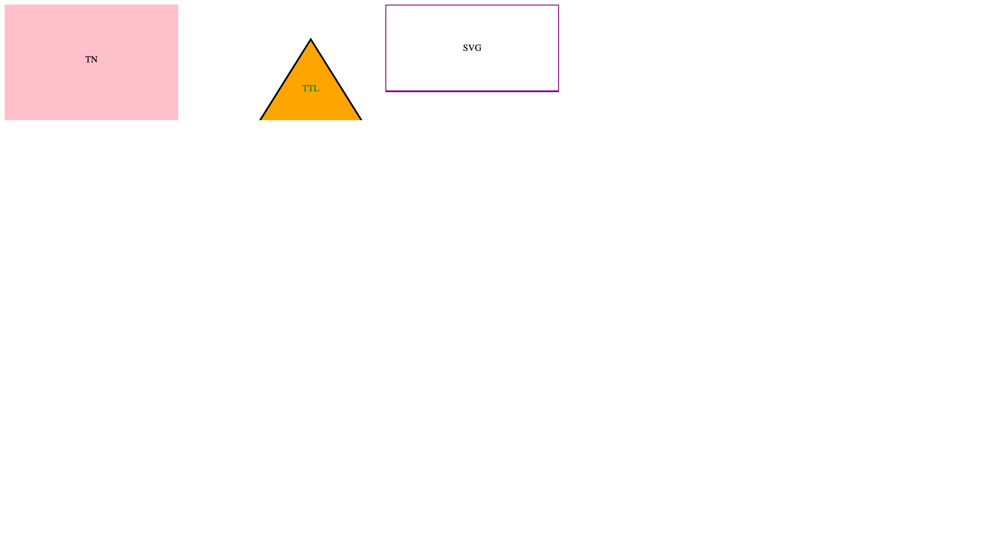

# SVG Logo Generator
## Description
The SVG logo Generator can generate a logo for your project using command line prompts.

- How can answer the prompts in the command line and choose from a variety of shapes, colors and text input to generate their SVG.
## Table of contents
- [Installation](#installation)
- [Usage](#Usage)
- [Contributing](#Contributing)
- [Tests](#Tests)
- [Questions](#Questions)
- [license](#license)

## Installation
- Users can clone the GitHub repo from the author GitHub profile.
- Users can run npm install in the command line to install all of the dependencies.
- Users can run the command mpn start in the command line to start the application.

## Usage
- For generating an SVG logo. 

### Screenshot

## Built with
### Programming Languages
- JavaScript
### Frameworks
- Node.js
### Libraries / Packages
- Inquirer
## Contributing
- Travis Nicholson
## Tests
- Jest testing was performed to test the shape classes.
## Questions
### links
- [GitHub Username](https://github.com/Travisnicholson90)

### Email
- For any further question relating to this project, please contact me via email.
[Travis Nicholson](mailto::nicholson_travis@hotmail.com)

## License

 - (https://opensource.org/licenses/MIT)

